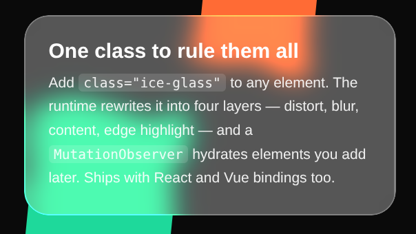

# ice-glass

English | [简体中文](./README.zh-CN.md)

[](https://www.npmjs.com/package/ice-glass)
[](https://www.npmjs.com/package/ice-glass)
[](https://bundlephobia.com/package/ice-glass)
[](./LICENSE)
[](https://docs.npmjs.com/generating-provenance-statements)

A refractive **ice-glass** UI effect — a four-layer composition
(SVG displacement refraction → backdrop blur → content → edge highlight)
packaged as a tiny library with **vanilla**, **React** and **Vue** bindings.

**[Live demo →](https://trirrin.github.io/ice-glass/)** &nbsp;•&nbsp;
**[Changelog →](./CHANGELOG.md)**



## Why

Most "glassmorphism" is a blur plus a white overlay. It looks cheap. Real
frosted glass refracts whatever sits behind it, then softens it, then lifts
a bright line along the edge. `ice-glass` does all three:

| Layer        | What it does                                         | Default                                                           |
| ------------ | ---------------------------------------------------- | ----------------------------------------------------------------- |
| `ig-distort` | SVG displacement refraction                          | `backdrop-filter: url(#ice-lens)` (scale `50`, baseFrequency `0.012`) |
| `ig-blur`    | Frosting + light tint                                | `backdrop-filter: blur(12px) saturate(170%)`; `background: rgba(255,255,255,0.3)` |
| `ig-content` | Your children — unaffected by any filter             | `position: relative; z-index: 2`                                  |
| `ig-edge`    | Hue-preserving rim via a masked ring                 | `padding: 1.5px`; `backdrop-filter: saturate(1.8) contrast(1.2)`  |

Compatibility: **Chrome 76+, Safari 17.4+, Edge**. Firefox has partial
support for `backdrop-filter: url()` — it degrades to the plain blur layer.

### DOM output

After hydration (or rendering the framework component), the wrapper contains
four siblings in a fixed order. **Your children live inside `.ig-content`,
not on the root** — keep that in mind when styling ancestors that rely on
direct-child selectors, flex/grid layout, or overflow handling:

```html
<div class="ice-glass" data-ice-ready="1">
  <div class="ig-distort" aria-hidden="true"></div>
  <div class="ig-blur"    aria-hidden="true"></div>
  <div class="ig-content">
    <!-- your slot / children -->
  </div>
  <div class="ig-edge"    aria-hidden="true"></div>
</div>
```

`.ice-glass` itself is `position: relative; overflow: hidden`. Layout rules
meant for your children (`display: flex`, `grid-template`, `overflow: auto`,
etc.) must target `.ig-content`, not `.ice-glass` — see the
[Scrollable surfaces](#scrollable-surfaces) recipe below.

## Install

```bash
npm install ice-glass
# or: pnpm add ice-glass / yarn add ice-glass / bun add ice-glass
```

The stylesheet is shipped separately so you can load it once per app:

```ts
import 'ice-glass/style.css';
```

---

## Vanilla JS

Zero setup, drop-in:

```html
<link rel="stylesheet" href="node_modules/ice-glass/dist/style.css">
<script type="module">
  import 'ice-glass/auto';   // auto-injects SVG filter + observes the DOM
</script>

<div class="ice-glass" style="border-radius:24px; padding:24px;">
  <h2>Hello, glass.</h2>
</div>
```

> **Do not use `ice-glass/auto` inside a React / Vue / Svelte app.** The
> auto runtime uses a `MutationObserver` to move slot children into
> `.ig-content`, which fights the framework's virtual DOM and corrupts
> diffs on the next re-render. Inside a framework, render the `<IceGlass>`
> component instead — it builds the four layers declaratively and marks
> the root with `data-ice-ready="1"` so the auto runtime (if also loaded)
> skips it.

Need explicit control? Import the core API instead:

```ts
import { observe, hydrate, injectSvgFilter } from 'ice-glass';

// One-liner: inject filter + hydrate existing nodes + watch future ones
const dispose = observe();

// Or do it manually
injectSvgFilter();
hydrate(document.querySelector('.my-card')!);

// Later
dispose();
```

## React

```tsx
import { IceGlass } from 'ice-glass/react';
import 'ice-glass/style.css';

export function Card() {
  return (
    <IceGlass className="card" style={{ borderRadius: 24, padding: 24 }}>
      <h2>Hello, glass.</h2>
    </IceGlass>
  );
}
```

Works with any standard `div` attribute, `ref`, event handlers, etc.

## Vue 3

```vue
<script setup>
import { IceGlass } from 'ice-glass/vue';
import 'ice-glass/style.css';
</script>

<template>
  <IceGlass class="card" :style="{ borderRadius: '24px', padding: '24px' }">
    <h2>Hello, glass.</h2>
  </IceGlass>
</template>
```

Or register it globally:

```ts
import { createApp } from 'vue';
import { IceGlass } from 'ice-glass/vue';

createApp(App).component('IceGlass', IceGlass).mount('#app');
```

A template `ref` on `<IceGlass>` resolves to the component instance, not
the root `<div>`. The underlying element is exposed as `el`:

```vue
<script setup lang="ts">
import { ref, onMounted } from 'vue';
import { IceGlass } from 'ice-glass/vue';

const card = ref<{ el: HTMLDivElement | null } | null>(null);

onMounted(() => {
  // e.g. measure the surface, focus it, or reach into .ig-content
  const rect = card.value?.el?.getBoundingClientRect();
  console.log('card size:', rect?.width, rect?.height);
});
</script>

<template>
  <IceGlass ref="card" class="card">…</IceGlass>
</template>
```

The React binding uses `forwardRef`, so a `ref` on `<IceGlass>` already
points at the root `<div>` directly.

---

## Customization

The four layers respond to normal CSS, so override freely.

```css
/* More transparent / less frosted */
.my-card.ice-glass > .ig-blur {
  background: rgba(255, 255, 255, 0.15);
  backdrop-filter: blur(6px);
}

/* Stronger refraction — tweak the displacement scale */
/* (override the filter definition or duplicate #ice-lens with a new id) */

/* Richer rim color — pushes saturation + contrast without hue drift */
.my-card.ice-glass > .ig-edge {
  backdrop-filter: saturate(2.2) contrast(1.3);
}
```

A rounded corner on the outer element is inherited by every inner layer
via `border-radius: inherit`, so you only set it once.

### Scrollable surfaces

`.ice-glass` sets `overflow: hidden` so the blur and edge layers can be
masked cleanly — putting `overflow: auto` on `.ice-glass` itself does
nothing. Push the scroll container down onto `.ig-content` instead:

```css
.scroll-card.ice-glass > .ig-content {
  overflow: auto;
  max-height: 320px;
}
```

The same trick works for any layout role your children need —
`display: flex`, `display: grid`, `padding-right` for a scrollbar gutter,
etc. Style `.ig-content`, not `.ice-glass`.

---

## Known limitations

- **Edge brightness on bright backgrounds.** Early versions used
  `brightness(> 1)` on `.ig-edge`; that clips to pure white on already-bright
  surfaces, so the rim disappears. Since `0.1.1` the edge uses
  `saturate(1.8) contrast(1.2)`, which amplifies whatever hue sits behind
  the component without clipping. The tradeoff: on very low-contrast
  backgrounds (e.g. flat light-gray on white) the rim is subtler than a
  pure-brightness boost. Override `.ig-edge`'s `backdrop-filter` if you
  want a different balance — see [Customization](#customization).
- **Firefox.** `backdrop-filter: url(#ice-lens)` is not fully supported, so
  refraction degrades to the plain blur layer. The component still renders
  a reasonable-looking glass surface.
- **Safari < 17.4.** `mask-composite: exclude` for the edge ring requires
  the `-webkit-mask-composite: xor` fallback that the stylesheet already
  provides; on older Safari the ring may render as a solid fill.

---

## API reference

```ts
// ice-glass
export function injectSvgFilter(): void;
export function hydrate(el: HTMLElement): void;
export function scan(root: ParentNode): void;
export function observe(options?: { root?: Node }): () => void;
export const SVG_HOST_ID: string;
export const FILTER_ID: string;

// ice-glass/react
export const IceGlass: React.ForwardRefExoticComponent<
  React.HTMLAttributes<HTMLDivElement> & React.RefAttributes<HTMLDivElement>
>;

// ice-glass/vue
// Component exposes { el: Ref<HTMLDivElement | null> } for direct DOM access.
export const IceGlass: import('vue').DefineComponent<{}, () => VNode, ...>;
```

All APIs are SSR-safe: they no-op when `document` is undefined, and the
framework components defer injection to `useEffect` / `onMounted`.

---

## Development

```bash
git clone https://github.com/Trirrin/ice-glass.git
cd ice-glass
npm install
npm run build       # tsup → dist/
npm run typecheck
```

Open `index.html` in a browser to see the standalone demo. No build step
needed for the demo — it is pure HTML + CSS + JS.

## License

MIT © 2026 [Trirrin](https://github.com/Trirrin)
